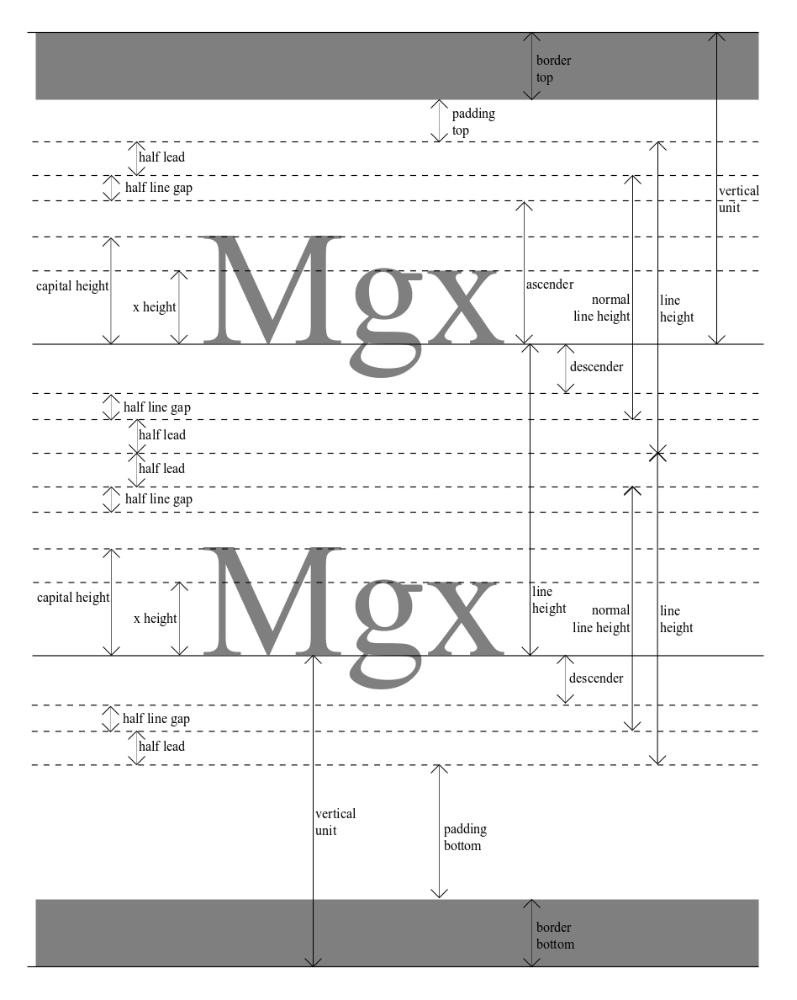

# postcss-baseline-vertical-rhythm [](https://travis-ci.com/melrosesolutions/postcss-baseline-vertical-rhythm)
A [PostCSS](http://postcss.org/) plugin to create a vertical rhythm with the baseline of text.

**WARNING!** This is very much experimental alpha software. It has not been used anywhere, let alone in production. As such, it should be considered very unstable and likely to change.

__TODO__ describe sub-pixel rounding
http://www.unumux.com/ux-insights/2016/2/24/subpixel-troubleshooting
https://engageinteractive.co.uk/blog/em-vs-rem-vs-px

__TODO__ consider making this a postcss-mixins function-mixin instead: https://github.com/postcss/postcss-mixins#function-mixin

## Usage
Install:
```
npm install postcss-baseline-vertical-rhythm --save-dev
```

Then include the plugin:
```js
postcss([ require('postcss-baseline-vertical-rhythm')(options) ])
```

See [PostCSS](http://postcss.org/) docs for examples for your environment.

## Theory
An in-depth explanation of font metrics can be found here: https://iamvdo.me/en/blog/css-font-metrics-line-height-and-vertical-align

By defining a vertical unit, you can create a vertical rhythm by setting heights, line-heights, (top and bottom) padding/margin/border to multiples of this unit. It gets complicated when you want to align the text's baseline to this grid too - this is different for every font, and there's no CSS property that can help.

This plugin attempts to solve this problem by using the font's specific metrics to set the text element's top and bottom padding.



## Preset Font Metrics
Currently, this plugin already has metrics defined for the following fonts:
* Arial
* TimesNewRoman

More common font metrics will be added in future.

## Custom Font Metrics
You can configure other fonts by following these steps:
1. Visit this link and upload a TTF version of your font: https://opentype.js.org/font-inspector.html
2. From the results, note the following values:
    * unitsPerEm = Font Header Table >> unitsPerEm
    * lineGap = Horizontal Header table >> lineGap
    * ascender = OS/2 and Windows Metrics table >> usWinAscent
    * descender = OS/2 and Windows Metrics table >> usWinDescent
3. Choose a unique name for the font, and add an item to the postcss plugin options e.g:
```
{
  fonts: [{
    fontName: 'Roboto',
    unitsPerEm: 2048,
    lineGap: 0,
    ascender: 1946,
    descender: 512
  }]
}
```

## Basic Usage
The following postcss plugin configuration defines a vertical unit of `17px`.
```
postcss({
  require('postcss-baseline-vertical-rhythm')({
    unit: 'px',
    verticalUnit: 17
  })
})
```

The custom at-rule in the CSS below tells the plugin we're using the `TimesNewRoman` font, so it knows which font metrics to use. The `font-size` property tells the plugin the font should be 24px (24 * the unit we defined in settings).

__NB:__ It will usually be necessary to override the default vertical margins to a multiple of the vertical unit, in this case via `margin: 0 0 17px;`
```
p {
  @baseline-vertical-rhythm {
    font-name: TimesNewRoman;
    font-size: 24;
  }

  font-family: TimesNewRoman, "Times New Roman", serif;
  margin: 0 0 17px;
}
```
The processed CSS will be:
```
p {
  font-size: 24px;
  line-height: 34px;
  padding-top: 8.9023px;
  padding-bottom: 8.0977px;

  font-family: TimesNewRoman, "Times New Roman", serif;
  margin: 0 0 17px;
}
```

## Options
Type `object | Null`

Default:
```
{
  unit: 'rem',
  verticalUnit: 1,
  debug: false,
  precision: 2,
  fonts: []
}
```

* `unit` (String) The unit to use for all calculations. Absolute units such as `rem` or `px` will probably be easier
* `verticalUnit` (Number) The number of units in the vertical rhythm
* `debug` (Boolean) If true, comments will be added to the processed CSS with calculated metrics
* `precision` (Integer) max decimal places output. Browsers like Edge round to 2 decimal places anyway, so setting a value of 2 (default) gives us more control.
* `fonts` (Array of Objects) Define metrics for additional fonts here (see _Custom Font Metrics_ section above)

## At-rule Properties
* `font-name` (String) Required. The name of the font being used
* `font-size` (Number) Required. The size of the font to be displayed
* `line-height-factor` (Integer). By default, the plugin will calculate line-height as the smallest multiple of the vertical-unit that's larger than the normal line height. If a `line-height-factor` is set, it overrides that value and can be used to create greater space between lines.
* `border-top-width` (Number default 0). If set, padding top value will allow for a top border of this thickness.
* `border-bottom-width` (Number default 0). If set, padding bottom value will allow for a bottom border of this thickness.
* `padding-top-extra` (Integer default 0). If set, allows for extra top padding as a multiple of the vertical unit.
* `padding-bottom-extra` (Integer default 0). If set, allows for extra bottom padding as a multiple of the vertical unit.

## Examples
Examples can be found in the `fixtures` folder. Clone the repository and open the html files to see them in action.

## Tips
### Background lines
While developing, add the following rule to see your grid and check everything aligns:
```
body {
    background-size: 1.5rem 1.5rem;
    background-image: linear-gradient(hsla(200, 100%, 70%, 0.5) 1px, transparent 1px);
}
```
Replace `1.5rem` with whatever your vertical unit is.

## Stylelint Config
If using [stylelint](https://stylelint.io/) to lint CSS, add the following rules to your configuration to prevent it breaking:
```
  "rules": {
    "at-rule-no-unknown": [true, {
      "ignoreAtRules": ["baseline-vertical-rhythm"]
    }],
    "property-no-unknown": [true, {
      "ignoreProperties": [
        "font-name",
        "line-height-factor",
        "padding-top-extra",
        "padding-bottom-extra"
      ]
    }]
  }
```

## Licence
Released under the MIT license.
